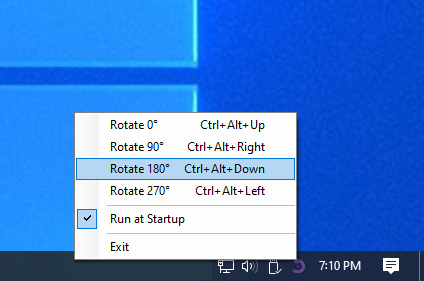

# Rotate Screen

Rotate your screen with `hotkeys`

## Features
- Run in background, hide app from taskbar.
- Notification icon include context menu.
- Run at startup.
- Single app instance.

## Todos
- Rotate `active screen` instead of `main screen`
- Allow changing hotkeys
- Update Run At Startup to avoid run older version of the app
